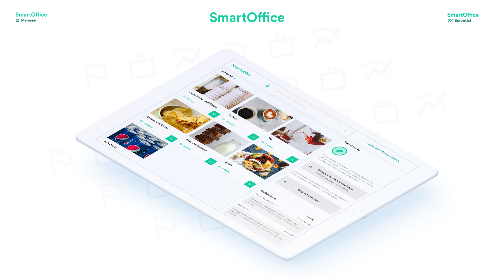

# fii-smart-office

# Project for FII-IP (II.2.) Course 2019 

#### Developers:
- Razvan Gabriel Apostu (Lead)
- Mocanu Alex
- Barbu Vlad
- Acsinte Matei 
- Badarau Bogdan 
- Popa Dorian

#### Description:
A smart platform for managing stock and consumables in a company.   
As an employee, you can quickly notify management about the lack of a certain item at the "coffee-station" near your office (e.g. No more milk). __The Front Office__     
As a company, you save money with the help of accurate predictions of the quantity needed by day. Special cases such as high-consumption periods (internships) or low (holidays) will be taken into account to keep away from overspending. __The Back Office and The Science Office__     

# Live prototypes
__UI:__ https://sketch.cloud/s/8YoYw  
__Presentation:__ [Slides](https://docs.google.com/presentation/d/1Exhjd5faIRZzHKV9I27OtIhJSb7XnLcMCSFdHZd6HQ4/edit?usp=sharing )    
__Front Office:__ https://priceless-dijkstra-ab3aef.netlify.com/   
__Back Office:__ https://cocky-mahavira-d62945.netlify.com/   

