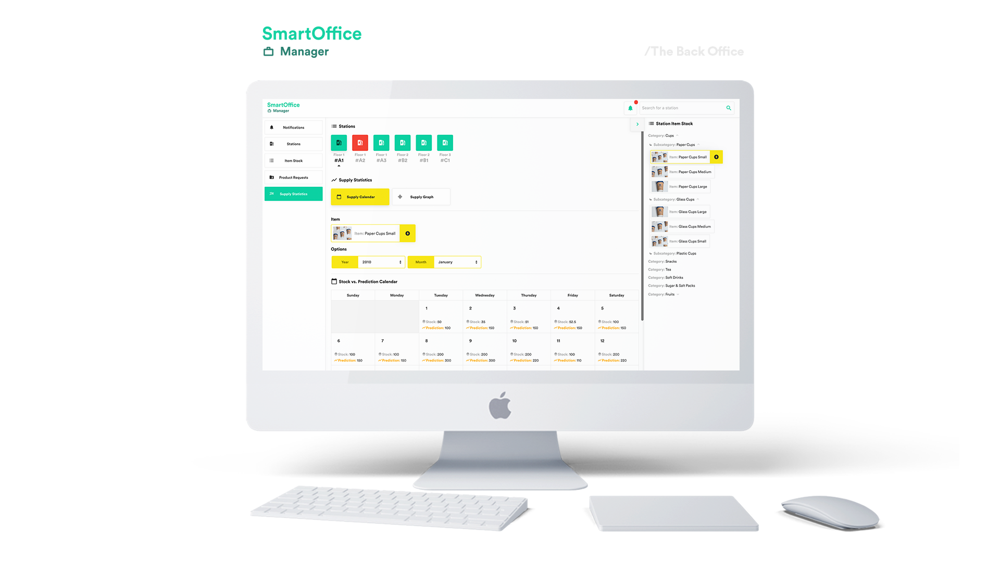

# fii-smart-office

# Smart Office Manager | The Back Office

#### Description:
A smart platform for managing stock and consumables in a company.   
As a company, you save money with the help of accurate predictions on the quantities needed and usage. Special cases such as high-consumption periods (internships) or low (holidays) will be taken into account to keep away from overspending. __The Back Office and The Science Office__     

#### Demo:
https://relaxed-goldberg-9d3a60.netlify.com/   

